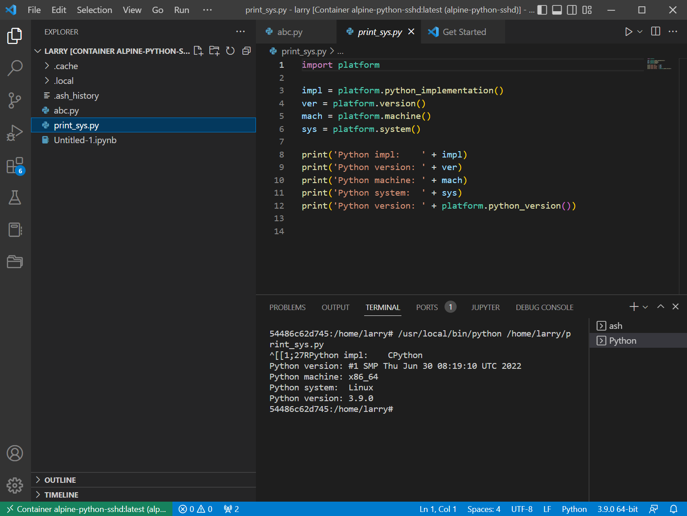
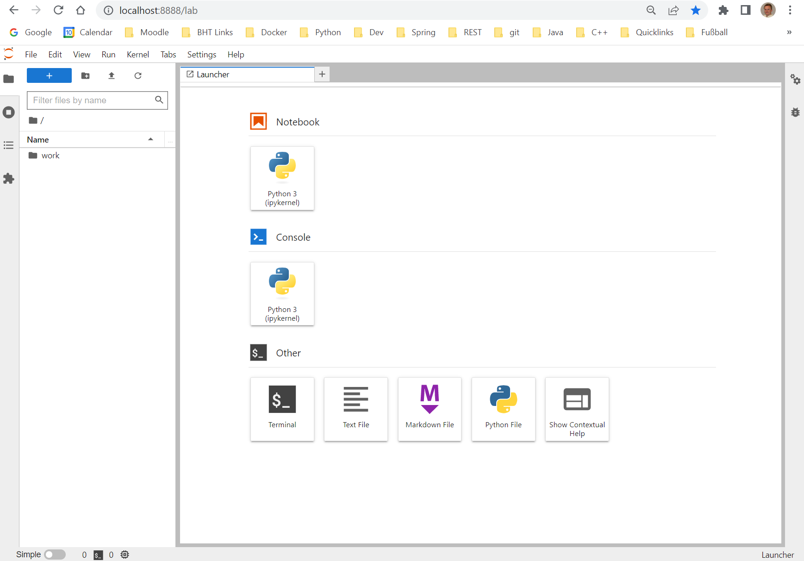
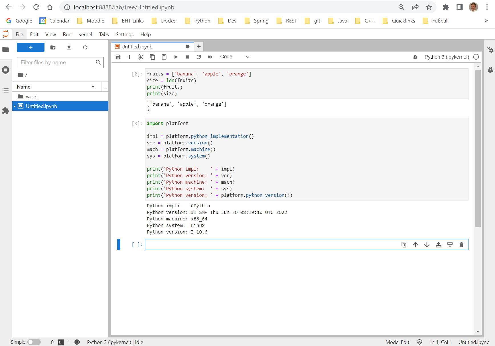

# Assignment B: Docker &nbsp; (<span style="color:red">18 Pts</span>)

This assignment will setup Docker. If you already have it, simply run challenges and answer questions (if any).

Docker is a popular software packaging, distribution and execution infrastructure using containers.
- Docker runs on Linux only (LXC). Mac, Windows have built adapter technologies.
- Windows uses an internal Linux VM to run Docker engine ( *dockerd* ).
- Client tools (CLI, GUI, e.g. [Docker Desktop](https://docs.docker.com/desktop/install/windows-install/) for Windows) are used to manage and execute containers.

Docker builds on Linux technologies:
- stackable layers of filesystem images that each contain only a diff to an underlying image.
- tools to build, manage and distribute layered images ("ship containers").
- Linux LXC technology to “execute containers” as groups of isolated processes on a Linux system (create/run a new container, start/stop/join container).

Salomon Hykes, PyCon 2013, Santa Clara CA: *"The Future of Linux Containers"* ([watch](https://www.youtube.com/watch?v=9xciauwbsuo), 5:21min).

### Challenges
1. [Challenge 1:](#1-challenge-1) Docker CLI
2. [Challenge 2:](#2-challenge-2) Run hello-world container
3. [Challenge 3:](#3-challenge-3) Run minimal (Alpine) Python container
4. [Challenge 4:](#4-challenge-4) Configure Alpine container for ssh
5. [Challenge 5:](#5-challenge-5) Build Alpine-Python container with ssh access
6. [Challenge 6:](#6-challenge-6) Setup IDE to develop Code in Alpine-Python
7. [Challenge 7:](#7-challenge-7) Setup Jupyter-server as a Docker container 

&nbsp;
### 1.) Challenge 1
Open a terminal and type commands:
```sh
> docker --version
Docker version 20.10.17, build 100c701
> docker --help
...
> docker ps                 ; dockerd is not running
error during connect: This error may indicate that the docker daemon is not runn
ing.

> docker ps                 ; dockerd is now running, no containers yet
CONTAINER ID   IMAGE     COMMAND   CREATED   STATUS    PORTS     NAMES
```
If you can't run the `docker` command, the client-side **docker-CLI** (Command-Line-Interface) may not be installed or not on the PATH-variable. If `docker ps` says: "can't connect", the **Docker engine** (server-side: *dockerd* ) is not running and must be started.

(2 Pts)

&nbsp;
### 2.) Challenge 2
Run the *hello-world* container from Docker-Hub: [hello-world](https://hub.docker.com/_/hello-world):
```sh
> docker run hello-world
Unable to find image 'hello-world:latest' locally
latest: Pulling from library/hello-world
2db29710123e: Pull complete
Digest: sha256:62af9efd515a25f84961b70f973a798d2eca956b1b2b026d0a4a63a3b0b6a3f2
Status: Downloaded newer image for hello-world:latest

Hello from Docker!
This message shows that your installation appears to be working correctly.
```
Show the container image loaded on your system:
```sh
> docker image ls
REPOSITORY       TAG           IMAGE ID       CREATED         SIZE
hello-world      latest        feb5d9fea6a5   12 months ago   13.3kB
```
Show that the container is still present after the end of execution:
```sh
> docker ps -a
CONTAINER ID  IMAGE        COMMAND   CREATED    STATUS     PORTS   NAMES
da16000022e0  hello-world  "/hello"  6 min ago  Exited(0)  magical_aryabhata
```
Re-start the container with an attached (-a) *stdout* terminal.
Refer to the container either by its ID ( *da16000022e0* ) or by its
generated NAME ( *magical_aryabhata* ).
```sh
> docker start da16000022e0 -a          or: docker start magical_aryabhata -a
Hello from Docker!
This message shows that your installation appears to be working correctly.
```
Re-run will create a new container and execut it. `docker ps -a ` will then
show two containers created from the same image.
```sh
> docker run hello-world
Hello from Docker!
This message shows that your installation appears to be working correctly.

> docker ps -a
CONTAINER ID  IMAGE        COMMAND   CREATED    STATUS     PORTS   NAMES
da16000022e0  hello-world  "/hello"  6 min ago  Exited(0)  magical_aryabhata
40e605d9b027  hello-world  "/hello"  4 sec ago  Exited(0)  pedantic_rubin
```
"Run" always creates new containers while "start" restarts existing containers.

(2 Pts)

&nbsp;
### 3.) Challenge 3
[Alpine](https://www.alpinelinux.org) is a minimal base image that has become
popular for building lean containers (few MB as opposed to 100's of MB or GB's).
Being mindful of resources is important for container deployments in cloud
environments where large numbers of containers are deployed and resource use
is billed.

Pull the latest Alpine image from Docker-Hub (no container is created with just
pulling the image). Mind image sizes: hello-world (13.3kB), alpine (5.54MB).
```sh
> docker pull alpine:latest
docker pull alpine:latest
latest: Pulling from library/alpine
Digest: sha256:bc41182d7ef5ffc53a40b044e725193bc10142a1243f395ee852a8d9730fc2ad
Status: Image is up to date for alpine:latest
docker.io/library/alpine:latest

> docker image ls
REPOSITORY       TAG           IMAGE ID       CREATED         SIZE
hello-world      latest        feb5d9fea6a5   12 months ago   13.3kB
alpine           latest        9c6f07244728   8 weeks ago     5.54MB
```
Create and run an Alpine container executing an interactive shell `/bin/sh` attached to the terminal ( `-it` ). It launches the shell that runs commands inside the Alpine
container.
```sh
> docker run -it alpine:latest /bin/sh
# ls -la
total 64
drwxr-xr-x    1 root     root          4096 Oct  5 18:32 .
drwxr-xr-x    1 root     root          4096 Oct  5 18:32 ..
-rwxr-xr-x    1 root     root             0 Oct  5 18:32 .dockerenv
drwxr-xr-x    2 root     root          4096 Aug  9 08:47 bin
drwxr-xr-x    5 root     root           360 Oct  5 18:32 dev
drwxr-xr-x    1 root     root          4096 Oct  5 18:32 etc
drwxr-xr-x    2 root     root          4096 Aug  9 08:47 home
drwxr-xr-x    7 root     root          4096 Aug  9 08:47 lib
drwxr-xr-x    5 root     root          4096 Aug  9 08:47 media
drwxr-xr-x    2 root     root          4096 Aug  9 08:47 mnt
drwxr-xr-x    2 root     root          4096 Aug  9 08:47 opt
dr-xr-xr-x  179 root     root             0 Oct  5 18:32 proc
drwx------    1 root     root          4096 Oct  5 18:36 root
drwxr-xr-x    2 root     root          4096 Aug  9 08:47 run
drwxr-xr-x    2 root     root          4096 Aug  9 08:47 sbin
drwxr-xr-x    2 root     root          4096 Aug  9 08:47 srv
dr-xr-xr-x   13 root     root             0 Oct  5 18:32 sys
drwxrwxrwt    2 root     root          4096 Aug  9 08:47 tmp
drwxr-xr-x    7 root     root          4096 Aug  9 08:47 usr
drwxr-xr-x   12 root     root          4096 Aug  9 08:47 var

# whoami
root

# uname -a
Linux aab69035680f 5.10.124-linuxkit #1 SMP Thu Jun 30 08:19:10 UTC 2022 x86_64

# exit
```
Commands after the `#` prompt (*root* prompt) are executed by the `/bin/sh` shell
inside the container. 

`# exit` ends the shell process and returns to the surrounding shell. The container
will go into a dormant (inactive) state.
```sh
> docker ps -a
CONTAINER ID  IMAGE         COMMAND   CREATED    STATUS     PORTS   NAMES
aab69035680f  alpine:latest "/bin/sh" 9 min ago  Exited     boring_ramanujan
```

The container can be restarted with any number of `/bin/sh` shell processes.

Containers are executed by **process groups** - so-called
[cgroups](https://en.wikipedia.org/wiki/Cgroups) used by
[LXC](https://wiki.gentoo.org/wiki/LXC) -
that share the same environment (filesystem view, ports, etc.), but are isolated
from process groups of other containers.

Start a shell process in the dormant Alpine-container to re-activate.
The start command will execute the default command that is built into the container
(see the COMMAND column: `"/bin/sh"`). The option `-ai` attaches *stdout* and *stdin*
of the terminal to the container.

Write *"Hello, container"* into a file: `/tmp/hello.txt`. Don't leave the shell.
```sh
> docker start aab69035680f -ai
# echo "Hello, container!" > /tmp/hello.txt
# cat /tmp/hello.txt
Hello, container!
#
```
Start another shell in another terminal for the container. Since it refers to the same
container, both shell processes share the same filesystem.
The second shell can therefore see the file created by the first and append another
line, which again will be seen by the first shell.
```sh
> docker start aab69035680f -ai
# cat /tmp/hello.txt
Hello, container!
# echo "How are you?" >> /tmp/hello.txt
```
First terminal:
```sh
# cat /tmp/hello.txt
Hello, container!
How are you?
#
```
In order to perform other commands than the default command in a running container,
use `docker exec`.

Execute command: `cat /tmp/hello.txt` in a third terminal:
```sh
docker exec aab69035680f cat /tmp/hello.txt
Hello, container!
How are you?
```
The execuition creates a new process that runs in the container seeing its filesystem
and other resources.

Explain the next command:
- What is the result?
- How many processes are involved?
- Draw a skech with the container, processes and their stdin/-out connections.
```sh
echo "echo That\'s great to hear! >> /tmp/hello.txt" | \
        docker exec -i aab69035680f /bin/sh
```
When all processes have exited, the container will return to the dormant state.
It will preserve the created file.

(2 Pts)

&nbsp;
### 4.) Challenge 4
Create a new Alpine container with name `alpine-ssh` and configure it for
[ssh](https://en.wikipedia.org/wiki/Secure_Shell) access.
```sh
docker run --name alpine-ssh -p 22:22 -it alpine:latest
```
Instructions for installation and confiduration can be found here:
["How to install OpenSSH server on Alpine Linux"](https://www.cyberciti.biz/faq/how-to-install-openssh-server-on-alpine-linux-including-docker) or here:
["Setting up a SSH server"](https://wiki.alpinelinux.org/wiki/Setting_up_a_SSH_server).

Add a local user *larry* with *sudo*-rights, install *sshd* listening on the
default port 22.

Write down commands that you used for setup and configuration to enable the
container to run *sshd*.

Verify that *sshd* is running in the container:
```sh
# ps -a
PID   USER     TIME  COMMAND
    1 root      0:00 /bin/sh
  254 root      0:00 sshd: /usr/sbin/sshd [listener] 0 of 10-100 startups
  261 root      0:00 ps -a
```

Show that *ssh* is working by login in as *larry* from another terminal:
```sh
> ssh larry@localhost

Welcome to Alpine!

The Alpine Wiki contains a large amount of how-to guides and general
information about administrating Alpine systems.
See <http://wiki.alpinelinux.org/>.

You can setup the system with the command: setup-alpine

You may change this message by editing /etc/motd.

54486c62d745:~$ whoami
larry

54486c62d745:~$ ls -la
total 32
drwxr-sr-x    1 larry    larry         4096 Oct  2 21:34 .
drwxr-xr-x    1 root     root          4096 Oct  2 20:40 ..
-rw-------    1 larry    larry          602 Oct  5 18:53 .ash_history

54486c62d745:~$ uname -a
Linux 54486c62d745 5.10.124-linuxkit #1 SMP Thu Jun 30 08:19:10 UTC 2022 x86_64 Linux
54486c62d745:~$
```

(4 Pts)

&nbsp;
### 5.) Challenge 5
[`python:latest`](https://hub.docker.com/_/python/tags) official image is 340MB while [`python:3.9.0-alpine`](https://hub.docker.com/_/python/tags?name=3.9-alpine&page=1) is ~18MB. The alpine-version builds on minimal Alpine Linux while the official version builds on Ubuntu. "Minimal" means available commands, tools inside the container is restricted. Only basic tools are available. Required additional tools need to be installed into the container.

Build an new ```alpine-python-sshd``` container based on the ```python:3.9.0-alpine``` image that includes Python 3.9.0 and ssh-access so that your IDE can remotely connect to the container and run/debug Python code inside the container, which is the final challenge.

Copy file [print_sys.py](https://github.com/sgra64/cs4bigdata/blob/main/A_setup_python/print_sys.py) from Assignment A into larry's ```$HOME``` directory and execute.
```sh
> ssh larry@localhost
Welcome to Alpine!

54486c62d745:~$ python print_sys.py
Python impl:    CPython
Python version: #1 SMP Thu Jun 30 08:19:10 UTC 2022
Python machine: x86_64
Python system:  Linux
Python version: 3.9.0
54486c62d745:~$
```

(4 Pts)

&nbsp;
### 6.) Challenge 6

Setup your IDE to run/debug Python code inside the `alpine-python-sshd` container. In Visual Studio Code (with extensions for "Remote Development", "Docker" and "Dev Containers"), go to the Docker side-Tab, Right-click the running container and "Attach Visual Studio Code". This opens a new VSCode Window with a view from inside the container with file [print_sys.py](https://github.com/sgra64/cs4bigdata/blob/main/A_setup_python/print_sys.py) from the previous challenge.

Run this file in the IDE connected to the container. Output will show it running under Linux, Python 3.9.0 in `/home/larry`.



(2 Pts)

&nbsp;
### 7.) Challenge 7

Setup a Jupyter-server from the [Jupyter Docker Stack](https://jupyter-docker-stacks.readthedocs.io/en/latest/index.html). Jupyter Docker Stacks are a set of ready-to-run Docker images containing Jupyter applications and interactive computing tools.

[Selecting an Image](https://jupyter-docker-stacks.readthedocs.io/en/latest/using/selecting.html) decides about the features preinstalled for Jupyter. Configurations exit for *all-spark-notebook* building on *pyspark-notebook* building on *scipy-notebook*, which builds on a *minimal-* and *base-notebook*, which builds on an *Ubuntu LTS* distribution. Other variations exist for *tensorflow-*, *datascience-*, or *R-notebooks*. 


Pull the image for the *minimal-notebook* (415 MB,  [tags](https://hub.docker.com/r/jupyter/minimal-notebook/tags/) ) and start it.

```sh
docker pull jupyter/minimal-notebook:latest
docker image ls

REPOSITORY                TAG     IMAGE ID       CREATED     SIZE
jupyter/minimal-notebook  latest  33f2fa3eb079   18h ago   1.39GB
```

Create the container with Jupyters default port 8888 exposed to the host environment.

Watch for the URL with the token in the output log.

```sh
docker run --name jupyter-minimal -p 8888:8888 jupyter/minimal-notebook

Entered start.sh with args: jupyter lab
Executing the command: jupyter lab
[I 2022-10-10 21:53:22.855 ServerApp] jupyterlab | extension was successfully linked.
...
To access the server, open this file in a browser:
http://127.0.0.1:8888/lab?token=6037ff448a79463b97e3c29af712b9395dd8548b
71d77769
```
After the first access with the token included in the URL, the browser
opens with http://localhost:8888/lab.



Start to work with Jupyter. A Jupyter notebook is a web-form comprised
of cells where Python commands can be entered. Execution is triggered
by `SHIFT + Enter`. Run the Code below (copy & paste from file *print_sys.py* ).



The notebook is stored **inside** the container under *Untitled.ipynb*.

Shut down the Jupyter-server with: File -> Shutdown.

Reatart the (same) container as "daemon" process running in the background (the container remembers flags given at creation: `-p 8888:8888`). The flag `-a` attaches a terminal to show log lines with the token-URL.

```sh
docker start jupyter-minimal -a
```

After login, the prior notebook with the code above is still there under *Untitled.ipynb*. Open and re-run the notebook.

A container preserves its state, e.g. files that get created. Docker 
simply adds them in another image layer. Therefore, the size of a
container is only defined by state changes that occured after the
creation of the container instance.

Shut down the Jupyter server with: File -> Shutdown, not with:
```sh
docker stop jupyter-minimal
```

(2 Pts)
