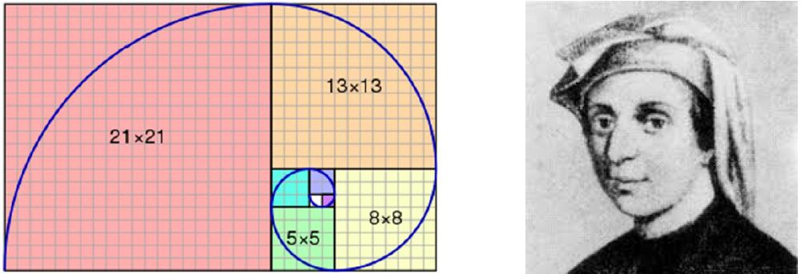

# Assignment E: Recursive Problem Solving &nbsp; (<span style="color:red">13 Pts + 4 Extra Pts</span>)

Recursion is not just a function calling itself, it is a way of thinking
about problems that can be split into simple cases and remaining sub-problems
that are smaller and ways to combine solutions returned from recursing on
sub-problems with the simple case.

Recursive problem solving follows four steps:
1. Return a trivial solution for a trivial case (e.g. value `0` for an empty list).
1. Split the problem into a simple case (e.g. a first element) and a remaining,
    small sub-problem (e.g. the remaining list with the first element removed).
1. Solve the sub-problem by recursively invoking the function on the sub-problem
    with no extra code.
1. Combine the final result from the simple case with the solution(s) returned
    for sub-problems.


### Challenges
1. [Challenge 1:](#1-challenge-1) Simple recursion: sum numbers
1. [Challenge 2:](#2-challenge-2) Fibonacci numbers
1. [Challenge 3:](#3-challenge-3) Permutation
1. [Challenge 4:](#4-challenge-4) Powerset
1. [Challenge 5:](#5-challenge-5) Find matches, Find pairs
1. [Challenge 6:](#6-challenge-6) Combinatorial Problem finding numbers
1. [Challenge 7:](#7-challenge-7) Hard Problem finding numbers (+4 extra points)
<!-- 1. [Challenge 8:](#8-challenge-8) Topic
1. [Challenge 9:](#9-challenge-9) Topic -->


&nbsp;
### 1.) Challenge 1
Pull file [E1_recursion.py](https://github.com/sgra64/cs4bigdata/blob/main/E_recursion/E1_recursion.py) and complete functions using recursion.

Follow the four steps for calculating `sum(numbers)`:
1. Return 0 for an empty list of numbers.
1. Split the problem by removing the first number `n1` from the list leaving `r` as
    remaining list (sub-problem).
1. Invoke `sum(r)` recursively on the remaining list.
1. Combine the result for the sub-problem with the first number `n1`:
    `return n1 + sum(r)`.

```py
def sum(self, _numbers) -> int:
    # your code
    return #...

if __name__ == '__main__':
    n1 = E1_recursion()
    print(f'n1.numbers: {n1.numbers}')
    print(f'sum(n1.numbers): {n1.sum(n1.numbers)}')
```

Output:
```sh
n1.numbers: [9, 4, 8, 10, 2, 4, 8, 3, 14, 4, 8]
sum(n1.numbers): 74
```
For a list of `n` numbers, how many recursive invocations are needed?

(1 Pts)


&nbsp;
### 2.) Challenge 2
[Fibonacci numbers](https://en.wikipedia.org/wiki/Fibonacci_number) were first
described in Indian mathematics as early as 200 BC in work by Pingala on enumerating
possible patterns of Sanskrit poetry formed from syllables of two lengths.

Italian mathematician *Leonardo of Pisa*, later known as *Fibonacci*, introduced
the sequence to Western European mathematics in his 1202 book *Liber Abaci*.



Numbers of the Fibonacci sequence are defined as each number is the sum of the
two preceding numbers. Fibonacci numbers are found in nature and social
behavior ([1:32min](https://www.youtube.com/watch?v=v6PTrc0z4w4) video).

Complete the functions `fib(n)` and `fig_gen(n)`.

```py
def fib(self, _n) -> int:
    # return value of n-th Fibonacci number
    return #...

def fib_seq(self, _n):
    # return a generator object that yields two lists, one with n and the
    # other with corresponding fib(n)
    yield #...

gen = n1.fib_seq(20)    # return generator object
n, fib = next(gen)      # trigger generator
print(f'n:      {n}')
print(f'fib(n): {fib}')
```

Output:
```sh
n:      [0, 1, 2, 3, 4, 5, 6, 7, 8, 9, 10, 11, 12, 13, 14, 15, 16, 17, 18, 19, 20]
fib(n): [0, 1, 1, 2, 3, 5, 8, 13, 21, 34, 55, 89, 144, 233, 377, 610, 987, 1597, 2584, 4181, 6765]
```

Explain the concept of a generator in Python.

(1 Pts)

&nbsp;


Why can't `fib(60)` be computed recursively?

```py
n = 30
print(f'fib({n}): {n1.fib(n)}')
n = 60
print(f'fib({n}): {n1.fib(n)}')     # ??
n = 90
print(f'fib({n}): {n1.fib(n)}')     # ??
```

Understand the problem and use a technique called `memoization`
( [link](https://stackoverflow.com/questions/7875380/recursive-fibonacci-memoization) )
to make the solution work (still recursively).

Output:
```sh
fib(30): 832040
fib(60): 1548008755920
fib(90): 2880067194370816120
```

(2 Pts)


&nbsp;
### 3.) Challenge 3
[Permutation](https://en.wikipedia.org/wiki/Permutation) is a list of all
arrangements of elements.

For example:
```py
perm([1, 2, 3]) -> [[1, 2, 3], [1, 3, 2], [2, 1, 3], [2, 3, 1], [3, 1, 2], [3, 2, 1]]

perm([]) -> [[]]
perm([1]) -> [[1]]
perm([1, 2]) -> [[1, 2], [2, 1]]
perm([1, 2, 3]) -> [[1, 2, 3], [1, 3, 2], [2, 1, 3], [2, 3, 1], [3, 1, 2], [3, 2, 1]]
perm([1, 2, 3, 4]) -> [[1, 2, 3, 4], [1, 2, 4, 3], ... [4, 3, 1, 2], [4, 3, 2, 1]]
```
Find a pattern how numbers are arranged for `perm([1, 2])` and `perm([1, 2, 3])`
and adapt it for `perm([1, 2, 3, 4])` to understand the algorithm.

Writing non-recursive code for that algorithm can be difficult, but it fits
well with the recursive sub-problen approach, which is elegant with the
four steps:
1. Return solutions for trivial cases: `[]`, `[1]`, `[1, 2]`.
1. Split the problem by removing the first number `n1` from the list leaving `r` as
    remaining list (sub-problem).
1. Invoke `perm(r)` recursively on the remaining list.
1. Combine the result returned from `perm(r)` by adding `n1` to each element.

```py
def perm(self, _numbers) -> list:
    res=[]  # collect result
    # code...
    # 1. Return solutions for trivial cases: `[]`, `[1]`, `[1, 2]`.
    # 2. Split the problem by removing the first number `n1` from the list
    #    leaving `r` as remaining list (sub-problem).
    # 3. Invoke `perm(r)` recursively on the remaining list.
    # 4. Combine the result by adding `n1` to each returned element from `perm(r)`.
    #
    return res

lst = [1, 2, 3]
perm = n1.perm(lst)
print(f'perm({lst}) -> {perm}')

lst = [1, 2, 3, 4]
perm = n1.perm(lst)
print(f'perm({lst}) -> {perm}')
```

Output:
```py
perm([1, 2, 3]) -> [[1, 2, 3], [1, 3, 2], [2, 1, 3], [2, 3, 1], [3, 1, 2], [3, 2, 1]]
perm([1, 2, 3, 4]) -> [[1, 2, 3, 4], [1, 2, 4, 3], ... [4, 3, 1, 2], [4, 3, 2, 1]]
```

With a rising length of the input list, how does the number of permutations grow?

(2 Pts)


&nbsp;
### 4.) Challenge 4
[Powerset](https://en.wikipedia.org/wiki/Powerset) is a list of all
subsets of elements including the empty set.

For example:
```py
pset([1, 2, 3]) -> [[], [1], [2], [1, 2], [3], [1, 3], [2, 3], [1, 2, 3]]
```
Undertstand the pattern and complete function `pset()`.

```py
def pset(self, _numbers) -> list:
    res=[]  # collect result
    # code...
    # 1. Return solutions for trivial cases: `[]`, `[1]`, `[1, 2]`.
    # 2. Split the problem by removing the first number `n1` from the list
    #    leaving `r` as remaining list (sub-problem).
    # 3. Invoke `pset(r)` recursively on the remaining list.
    # 4. Combine the result with the first element.
    #
    return res

lst = [1, 2, 3]
pset = n1.pset(lst)
print(f'pset({lst}) -> {pset}')
```

Output:
```py
pset([1, 2, 3]) -> [[], [1], [2], [1, 2], [3], [1, 3], [2, 3], [1, 2, 3]]
```

With a rising length of the input list, how does the size of the Powerset grow?

(2 Pts)


&nbsp;
### 5.) Challenge 5
Write three functions to `find` elements in a list.

The first function to `find` elements that match a boolean `match_func`.

A second function `find_adjacent` that finds all indexes of adjacent pairs
of numbers.

The third function `find_pairs` that finds all pairs of numbers (not necessarily
adjacent) with the sum equal to `n`. For example, `n=12` can be combined from
the input list with pairs: `[3, 9], [4, 8], [2, 10]`.

```py
def find(self, _numbers, match_func) -> list:
    res = []    # code...
    return res


def find_adjacent(self, pair, _numbers) -> list:
    res = []    # code...
    return res


def find_pairs(self, n, _numbers) -> list:
    res = []    # code...
    return res


lst = [9, 4, 8, 10, 2, 4, 8, 3, 14, 4, 8]   # input list
#
div3 = n1.find(lst, match_func=lambda n : n % 3 == 0)
print(f'find numbers divisible by 3: {div3}')
#
p = [4, 8]  # find all indexes of adjacent numbers [4, 8]
adj = n1.find_adjacent(p, lst)
print(f'find_adjacent({p}, list): {adj}')
#
n = 12  # find all pairs from the input list that add to n
pairs = n1.find_pairs(n, lst)
print(f'find_pairs({n}, list) -> {pairs}')
```

Output:
```sh
find numbers divisible by 3: [9, 3]

find_adjacent([4, 8], list): [1, 5, 9]

find_pairs(12, list) -> [[3, 9], [4, 8], [2, 10]]
```
With a rising length of the input list, how many steps are needed to
complete each function in the best and worst case and on average?

| function         | answers     |
| ---------------- | ----------- |
| `find`           | best case: ______, worst case: ______, average: ______ steps.  |
| `find_adjacent`  | best case: ______, worst case: ______, average: ______ steps.  |
| `find_pairs`       | best case: ______, worst case: ______, average: ______ steps.  |

(3 Pts)


&nbsp;
### 6.) Challenge 6
`find_all_sums` is a function that returns any combination of numbers from the
input list that add to `n`. For example, `n=14` can be combined from an
input list: `[8, 10, 2, 14, 4]` by combinations: `[4, 8, 2], [4, 10], [14]`.

A first approach to the problem is to understand the nature of possible
combinations from the input list. If all those combinations could be
generated, each could be tested whether their elements add to `n` and if,
collect them for the final result.

The order of numbers in solutions is not relevant (summation is commutative).
Duplicate solutions with same numbers, but in different order need be to removed.

```py
def find_all_sums(self, n, _numbers) -> list:
    res = []    # code...
    return res


lst = [8, 10, 2, 14, 4]     # input list
n = 14
all = n1.find_all_sums(n, lst)
print(f'find_all_sums({n}, lst) -> {all}')
```

Output:
```py
find_all_sums(14, lst) -> [[4, 8, 2], [4, 10], [14]]
```

Test your solution with a larger input set:
```py
lst = [     # input list
    260, 720, 225, 179, 101, 767, 167, 200, 157, 289,
    318, 303, 153, 290, 201, 594, 457, 607, 592, 246,
]
n = 469
all = n1.find_all_sums(n, lst)
print(f'find_all_sums({n}, lst) -> {all}')
```

Output:
```sh
find_all_sums(469, lst) -> [[179, 290], [101, 167, 201]]
```

With a rising length of the input list, how does the number of possible
solutuions rise that must be tested?

(2 Pts)


&nbsp;
### 7.) Challenge 7
Larger data sets can no longer be solved *"brute force"* by exploring all possible
2^n combinations.

Find a solution using a recursive approach exploring a decision tree or
with tabulation.

```py
lst = [     # input list
    260, 720, 225, 179, 101, 767, 167, 200, 157, 289,
    318, 303, 153, 290, 201, 594, 457, 607, 592, 246,
    132, 135, 584, 432, 591, 204, 417, 405, 362, 658,
    136, 751, 583, 536, 293, 493, 431, 780, 563, 703,
    400, 618, 397, 320, 513, 708, 319, 317, 685, 347,
    758, 439, 145, 378, 158, 384, 551, 110, 408, 648,
    847, 498,  50,  19,     # 64 numbers
]
n = 469
all = n1.find_all_sums(n, lst)
for i, s in enumerate(all):
    print(f' - {i+1:2}: sum({sum(s)}) -> {s}')
```
Sort output by lenght of solution (use length as primary and numeric value
of first element as secondary criteria).

Output:
```
  1: sum(469) -> [290, 179]
  2: sum(469) -> [19, 157, 293]
  3: sum(469) -> [19, 246, 204]
  4: sum(469) -> [19, 318, 132]
  5: sum(469) -> [19, 400, 50]
  6: sum(469) -> [50, 101, 318]
  7: sum(469) -> [110, 201, 158]
  8: sum(469) -> [136, 201, 132]
  9: sum(469) -> [145, 167, 157]
 10: sum(469) -> [158, 179, 132]
 11: sum(469) -> [201, 101, 167]
 12: sum(469) -> [19, 101, 204, 145]
 13: sum(469) -> [19, 157, 135, 158]
 14: sum(469) -> [19, 179, 135, 136]
 15: sum(469) -> [19, 204, 136, 110]
 16: sum(469) -> [19, 290, 110, 50]
 17: sum(469) -> [19, 101, 167, 132, 50]
 18: sum(469) -> [19, 132, 158, 110, 50]
```

( +4 Extra Pts)


<!-- &nbsp;
&nbsp;
### 8.) Challenge 8

&nbsp;
### 9.) Challenge 9 -->
